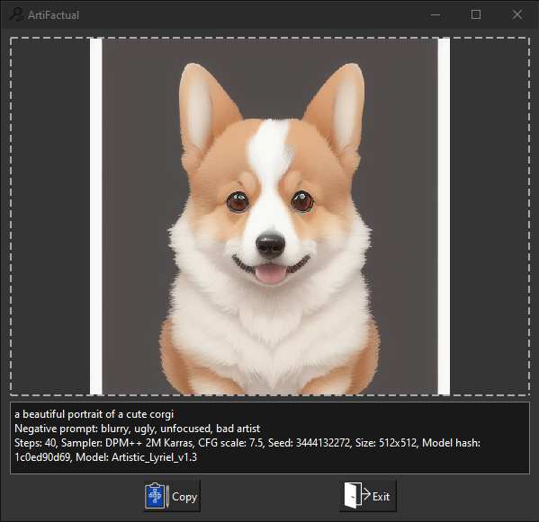

# ArtiFactual

[](https://opensource.org/licenses/MIT)
[](https://www.python.org/downloads/)

ArtiFactual is a simple library and desktop application that allows users to decode and view encoded information from images easily and conveniently. It works by reading generation information or imprinted data of an image and displaying it, ensuring that the image file serves as a standalone ship.

## Table of Contents

- [Features](#features)
- [Getting Started](#getting-started)
- [Usage](#usage)
- [Contribution](#contribution)
- [License](#license)

## Features

- Decode encoded information from images, either metadata or fingerprinted.
- Encode information into images (Library only for now)
- View decoded data in a simple and convenient way
- Supports drag and drop Files and URLs (so works w/ Discord and links)
- Uses QT6/PySide6 for GUI
- Standalone desktop application for ease of use

## Examples



## Getting Started

### Prerequisites

- Python 3.7 or higher

### Installation

1. Clone the repository:

   ```
   git clone https://github.com/kjerk/artifactual.git
   ```

2. Navigate to the project directory:

   ```
   cd artifactual
   ```

3. Install required dependencies:

   ```
   pip install -r requirements.txt
   ```

4. Run the application:

   ```
   python app_dropid.py
   ```

### Todo List
* ✅ Add readme and screenshots
* ✅ Be excellent to each other
* ☐ Add support for decoding with a password (in lib but not gui)

## License

ArtiFactual is licensed under the [MIT License](LICENSE).
